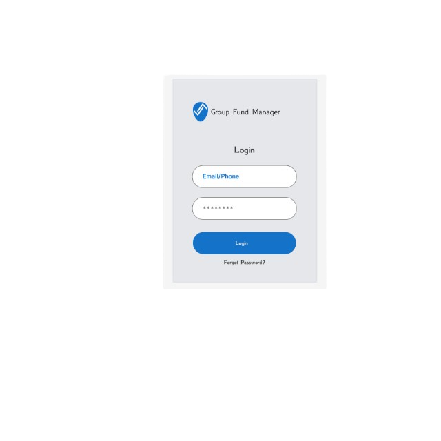
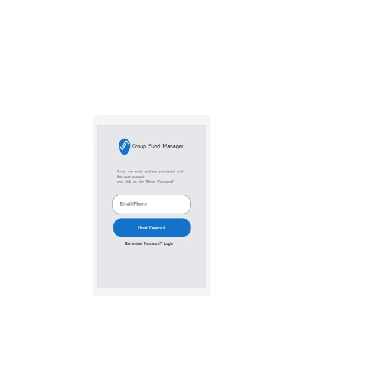

For more information: [group-fund-manager.app](https://group-fund-manager.vercel.app)

# Group Fund Manager

Enables Small Investment Group Administrators to Record Savings, Loans, and Investment transactions to ease book keeping.

## App Screenshots

